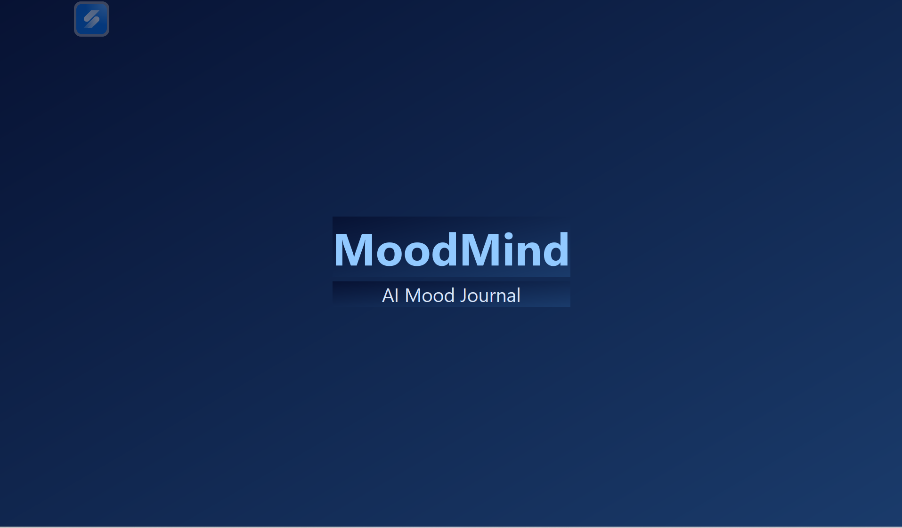
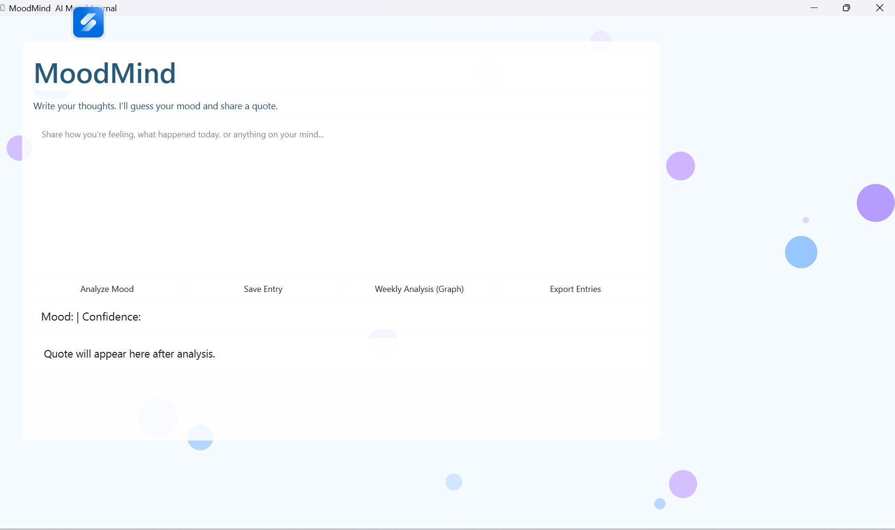

#Mood Mind - AI-Mood-Journal

Mood Mind is a Python-based application focused on mood analysis and emotional awareness.
It helps users reflect on their emotional state by analyzing input text and providing supportive, structured feedback.

The project is designed as a self-reflection and awareness tool, not a medical or psychological diagnostic system.

---

 Features

💬 User text input for mood expression

🧠 Mood / sentiment analysis based on language patterns

📊 Clear mood interpretation and feedback

🖥️ Simple and distraction-free UI

🧩 Focus on clarity, empathy, and user experience

---

🛠️ Tech Stack

Language: Python

UI Framework: Python-based GUI

AI / NLP: AI-assisted text analysis

Data Handling: JSON, datetime

AI Assistance: Used during development (see disclosure below)

---

🧠 How It Works

1. User enters text describing their current mood or thoughts

2. The application processes the input using AI/NLP techniques

3. Emotional patterns and sentiment are analyzed

4. The app returns:

Mood interpretation

Supportive or reflective feedback

Clear, readable output for the user

The focus is on emotional clarity, not diagnosis.

---

🧩 Intended Purpose

Mood Mind is meant for:

Self-reflection

Emotional awareness

Demonstrating AI + UI integration

Educational and portfolio purposes

It is not intended for:

Mental health diagnosis

Medical or therapeutic decision-making

---

🤖 AI Usage Disclosure (Important)

AI tools were used during development to:

Assist with sentiment analysis logic

Help structure empathetic responses

Improve prompt design and output clarity

Support learning and faster development

All implementation decisions — including UI flow, feature scope, and ethical boundaries — were made intentionally to demonstrate understanding and responsibility.

---

⚠️ Disclaimer

> Mood Mind is an awareness and reflection tool only.
It does not replace professional mental health advice, diagnosis, or treatment.

If a user is experiencing distress, they should seek support from qualified professionals.

---

📸 Screenshots

(Displays mood input and AI-generated reflective feedback)

---

📌 Use Cases

Emotional self-reflection

Demonstrating sentiment analysis

AI + Python GUI portfolio project

UX-focused AI interaction demo

---

📈 Future Improvements

Mood history tracking

Emotion trend visualization

Improved sentiment granularity

Personalization settings

Exporting reflections

---

👤 Author

Rashika (Riv)
Python • AI-assisted Applications • UI Design

---

⭐ Acknowledgements

Built using AI-assisted development tools and NLP concepts for educational purposes.

